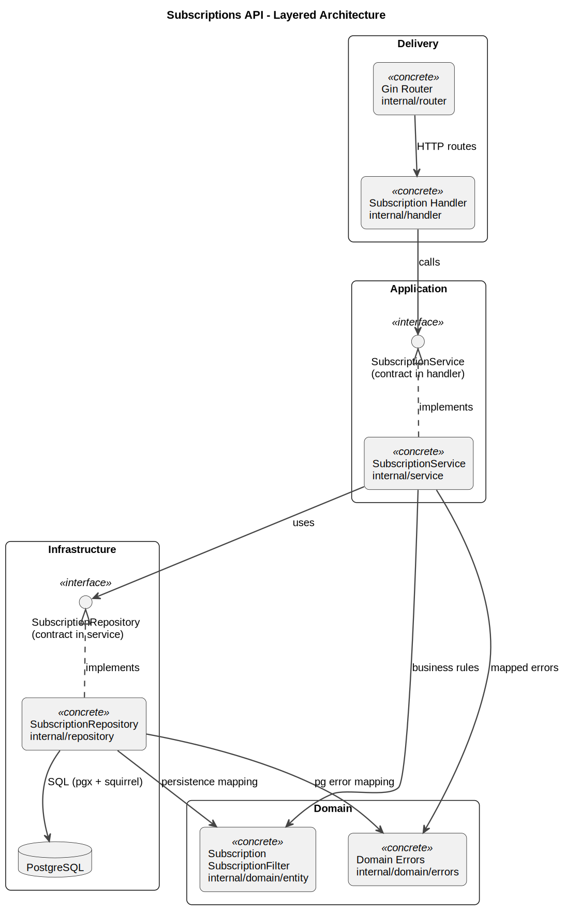
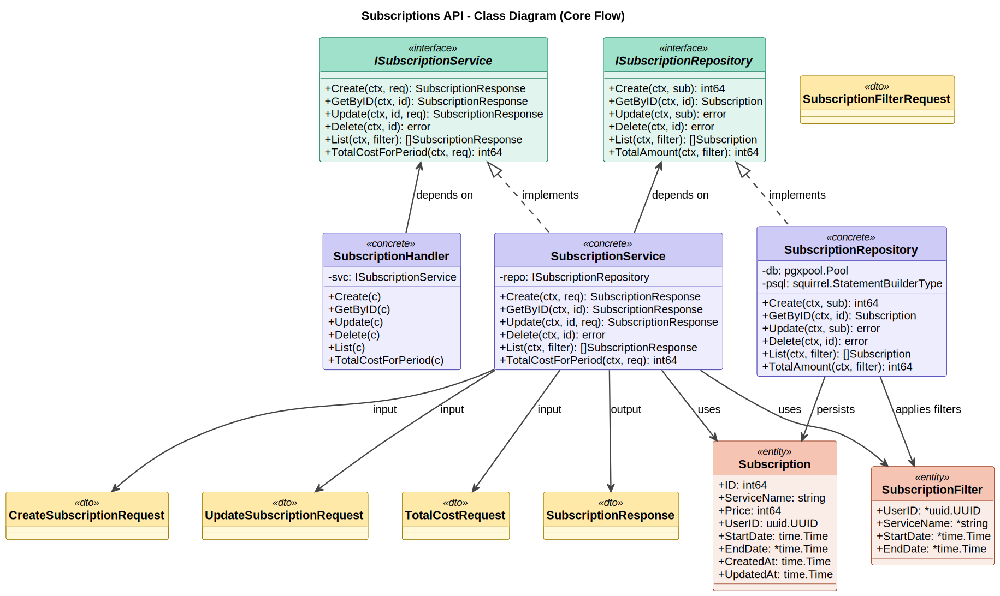

# Subscriptions API

Production-style REST API для управления подписками пользователей.

Стек: `Go` + `Gin` + `PostgreSQL` + `pgx` + `squirrel` + `zap` + `swaggo`.

## Contents

- [Что умеет сервис](#что-умеет-сервис)
- [Архитектура](#архитектура)
- [Диаграммы](#диаграммы)
- [Структура проекта](#структура-проекта)
- [Быстрый старт](#быстрый-старт)
- [Конфигурация](#конфигурация)
- [API](#api)
- [Примеры запросов](#примеры-запросов)
- [Команды Makefile](#команды-makefile)
- [Технологии](#технологии)

## Что умеет сервис

- CRUD подписок: создать, получить, обновить, удалить.
- Фильтрация списка подписок по `user_id` и `service_name`.
- Подсчёт суммарной стоимости подписок за период.
- Swagger UI для интерактивного тестирования API.
- Централизованный маппинг ошибок БД в доменные ошибки.

## Архитектура

Сервис построен по многослойной архитектуре с разделением ответственности:

- `handler`:
  - HTTP-уровень, парсинг/валидация request, формирование response.
- `service`:
  - бизнес-правила и оркестрация use-case.
- `repository`:
  - работа с PostgreSQL и SQL-конструирование через `squirrel`.
- `domain`:
  - сущности и доменные ошибки.

Зависимости направлены сверху вниз:

`handler -> service -> repository -> postgres`

## Диаграммы

Архитектурные UML-диаграммы лежат в `docs/diagrams`:

- Архитектура слоёв:
  - [subscriptions_architecture.svg](docs/diagrams/subscriptions_architecture.svg)
- Классы/контракты:
  - [subscriptions_class.svg](docs/diagrams/subscriptions_class.svg)
### Preview





## Структура проекта

```text
subscriptions-api/
├── cmd/subscriptions-api/     # entrypoint, graceful shutdown
├── configs/                   # YAML конфиги (local/docker)
├── docs/
│   ├── swagger/               # OpenAPI/Swagger
│   └── diagrams/              # PlantUML + SVG диаграммы
├── internal/
│   ├── config/                # загрузка конфигурации
│   ├── db/postgres/           # pgxpool connection
│   ├── domain/
│   │   ├── entity/            # Subscription, SubscriptionFilter
│   │   └── errors/            # доменные ошибки + map PG errors
│   ├── dto/                   # request/response + mapper'ы
│   ├── handler/               # Gin handlers
│   ├── logger/                # zap logger
│   ├── repository/            # SQL + persistence
│   ├── router/                # route registration
│   └── service/               # business logic
├── migrations/                # SQL миграции
├── Dockerfile
├── docker-compose.yml
├── Makefile
└── .env.example
```

## Быстрый старт

### Вариант 1: Docker (рекомендуется)

1. Подготовь окружение:

```bash
cp .env.example .env
```

2. Подними контейнеры:

```bash
make docker-run
```

3. Накати миграции:

```bash
make migrate-up
```

4. Проверь сервис:

- API: `http://localhost:8080`
- Health: `http://localhost:8080/health`
- Swagger: `http://localhost:8080/swagger/index.html`

### Вариант 2: Локальный запуск

Требуется локальный PostgreSQL и утилита `migrate`.

```bash
# macOS
brew install golang-migrate

# запуск API
go run cmd/subscriptions-api/main.go

# миграции
make migrate-up
```

## Конфигурация

Источник конфигурации:

- Docker: `configs/config.docker.yaml`
- Локально: `configs/config.local.yaml`

Важные переменные `.env`:

- `POSTGRES_DB`
- `POSTGRES_USER`
- `POSTGRES_PASSWORD`
- `POSTGRES_PORT`
- `APP_PORT`

Пример `.env` уже есть в `.env.example`.

## API

Base URL: `http://localhost:8080/api/v1`

| Метод | Путь | Описание |
| ----- | ---- | -------- |
| `POST` | `/subscriptions` | Создать подписку |
| `GET` | `/subscriptions` | Получить список подписок |
| `GET` | `/subscriptions/{id}` | Получить подписку по ID |
| `PUT` | `/subscriptions/{id}` | Обновить подписку |
| `DELETE` | `/subscriptions/{id}` | Удалить подписку |
| `GET` | `/subscriptions/total` | Суммарная стоимость за период |

Дополнительно:

- `GET /health`
- `GET /swagger/index.html`

## Примеры запросов

### Create

```bash
curl -X POST 'http://localhost:8080/api/v1/subscriptions' \
  -H 'Content-Type: application/json' \
  -d '{
    "service_name": "Netflix",
    "price": 499,
    "user_id": "60601fee-2bf1-4721-ae6f-7636e79a0cba",
    "start_date": "2025-07-01T00:00:00Z"
  }'
```

### List with filters

```bash
curl 'http://localhost:8080/api/v1/subscriptions?user_id=60601fee-2bf1-4721-ae6f-7636e79a0cba&service_name=Netflix'
```

### Total for period

```bash
curl 'http://localhost:8080/api/v1/subscriptions/total?period_start=2025-10-01T00:00:00Z&period_end=2025-12-31T23:59:59Z&user_id=60601fee-2bf1-4721-ae6f-7636e79a0cba'
```

### Update

```bash
curl -X PUT 'http://localhost:8080/api/v1/subscriptions/1' \
  -H 'Content-Type: application/json' \
  -d '{
    "service_name": "Yandex Plus",
    "price": 599
  }'
```

### Delete

```bash
curl -X DELETE 'http://localhost:8080/api/v1/subscriptions/1'
```

## Команды Makefile

```bash
make run               # запустить локально
make build             # собрать бинарник
make fmt               # go fmt
make vet               # go vet

make migrate-up        # применить миграции
make migrate-down      # откатить миграции
make migrate-version   # показать текущую версию
make migrate-force V=1 # принудительно установить версию

make docker-run        # docker compose down -v && build && up
make generate-swagger  # регенерация swagger
```

## Технологии

- Go 1.25
- Gin
- PostgreSQL 16
- pgx / pgxpool
- squirrel
- Viper
- zap
- swaggo
- Docker / Docker Compose
